## O que é Github e Github pages?

**GitHub** é um sistema que tem como principal intuito o gerenciamento de projetos e versões de código. Porém, além do seu foco principal, ele oferece vários outros serviços desde o **Github pages** até mesmo ser uma rede social de desenvolvedores.

Já o **GitHub pages** como foi apresentado, é um dos serviço oferecidos pelo github, onde de forma rápida e simples é possível hospedar gratuitamente sites direto dos seus **repositórios** no Github. **Repositório** é a pasta raiz do seu projeto, onde todos os arquivos necessários para o projeto ficam dentro do mesmo.

## 1 - Criando uma conta no Github

De forma rápida e prática, acesse [github.com](https://github.com/) e clique em **Sign up (inscrever-se)**, como mostra a Imagemm 1.1.


Imagem 1.1 - Clicando em Sign up (inscrever-se).

Depois basta preencher todos os campos e efetuar **Sign in (login)**, então estamos prontos para continuar.

## 2 - Criando sua página pessoal no Github

Após estar logado no Github, vamos criar o nosso repositório clicando em **new**, como na Imagem 2.1.

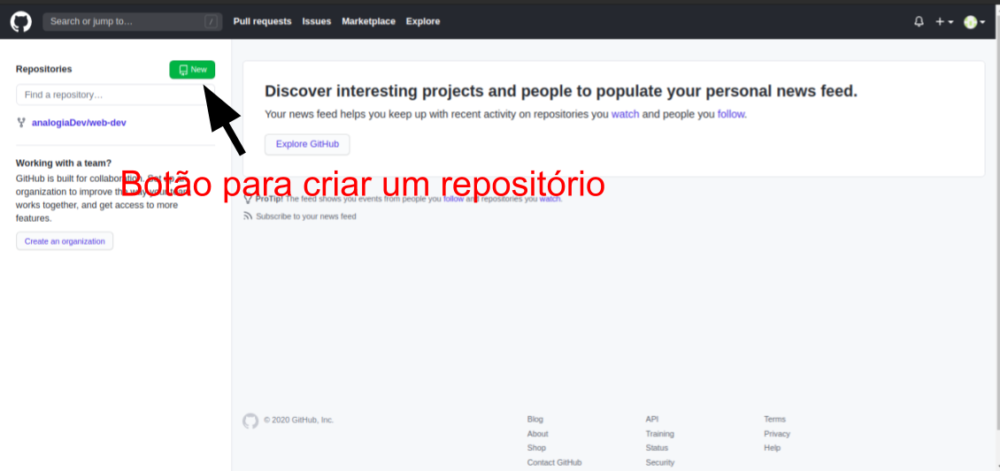

Imagem 2.1 - Criando um novo repositório

Em seguida irá aparecer uma tela como na Imagem 2.2.

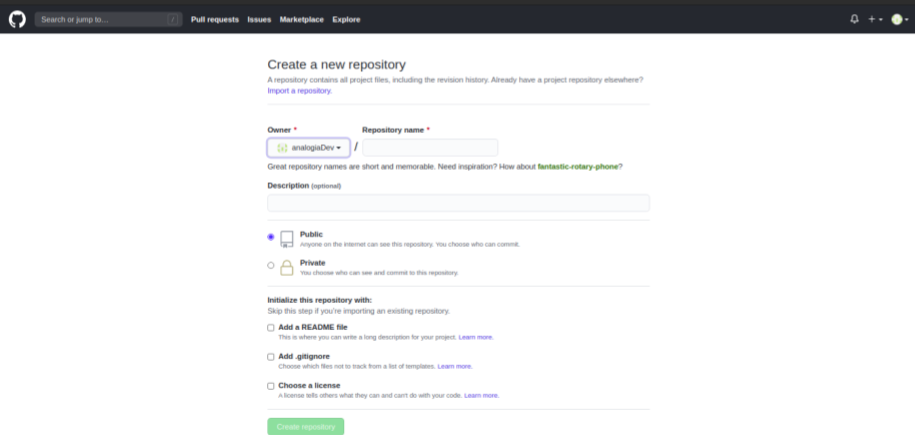

Imagem 2.2 - Estrutura para criação de um repositório

Em **Repository name (Nome do repositório)** devemos especificar um nome para nosso site como mostra a Imagemm 2.3, porém para que seja possível )ativar) o github pages, é necessário que o repositório seja nomeado com **user-name.github.io**, onde devemos substituir **user-name** por o seu nome de usuário. Caso não lembre seu nome de usuário, ele é o valor contído no campo **Owner** como mostra a Imagem 2.3.

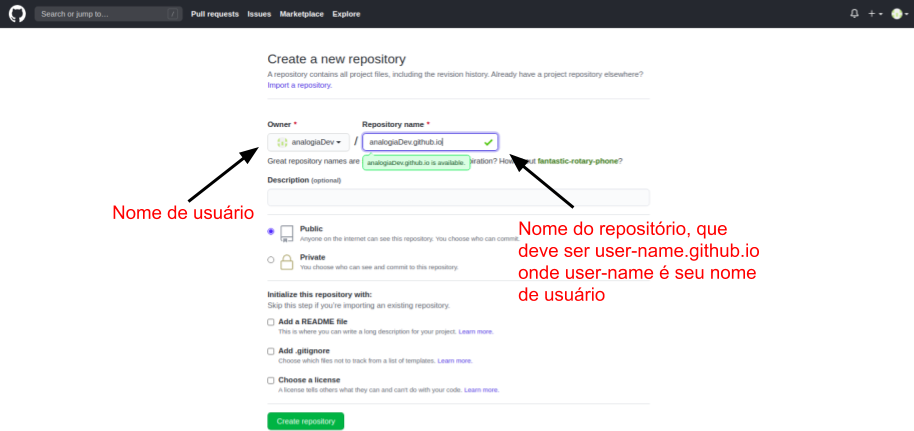

Imagem 2.3 - Nome do repositório

No github os repositórios podem ser públicos ou privados. A principal diferença entre os dois tipos são a sua vizualização, onde o público qualquer pessoa pode o vizualizar, já o privado só é possível por pessoas com sua autorização. No caso do Github pages, é preciso que seu repositório seja público, por isso vamos marcar a opção **Public (Público)** como na figura 2.4.

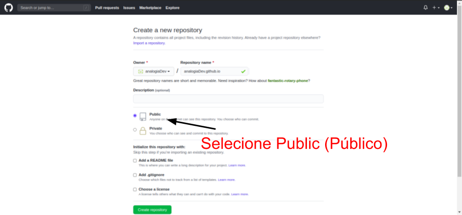

Imagem 2.4 - Selecionando Public (Público)

Após isso, clique em **create repository (Criar repositório)** para que o seu repositório seja criado. Em seguida irá aparecer uma tela como a Imagem 2.5.

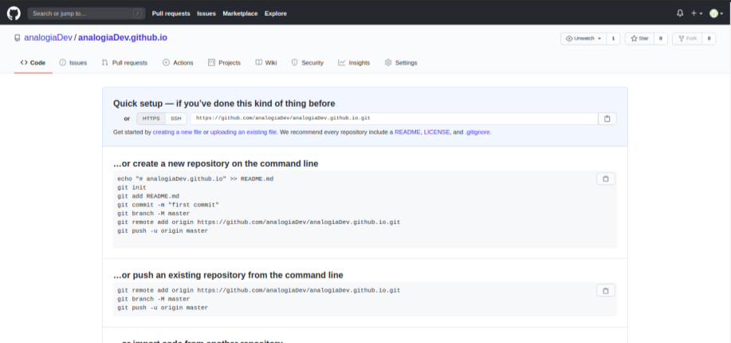

Imagem 2.5 - Configurações inicias do projeto

Vamos **copiar o link do repositório**, para que seja possível **clonar** o mesmo.

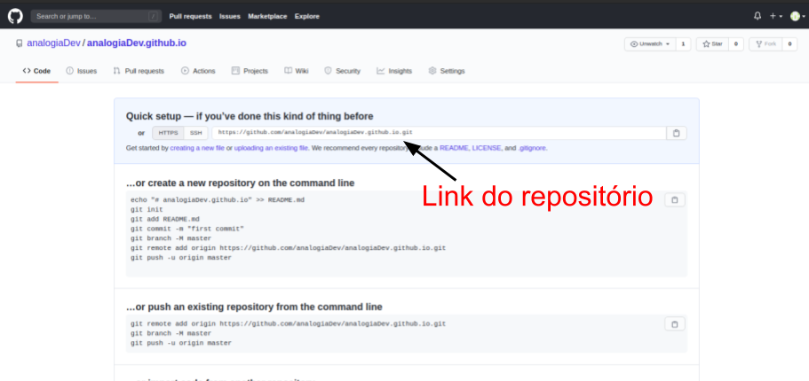

Imagem 2.6 - Copiando o link do repositório

## 3 - Criando a estrutura básica do seu site pessoal

Abra o seu terminal e acesse a pasta no qual você quer salvar seu repositório. Para acessar uma pasta já existente no computador, basta digitar `cd pasta`, onde devemos substituir `pasta` por a pasta que queremos entrar, até chegar na desejada, como na Imagem 2.7.

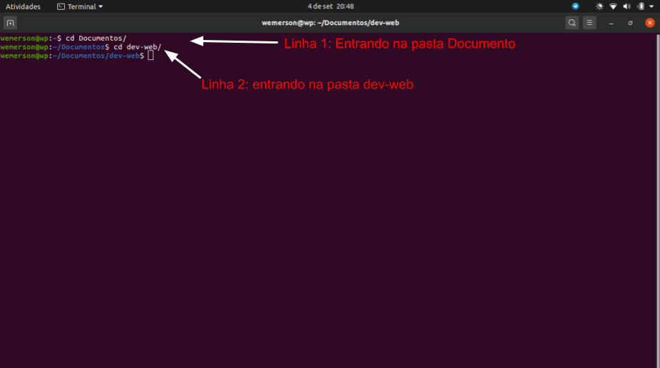

Imagem 3.1 - Entrando em uma pasta existente para clonar o repositório para a mesma

Caso esteja tentando acessar uma pasta e não esteja conseguindo, basta utilizar o comando `dir` no windows (Imagem 3.3.1) ou `ls` no linux (Imagem 3.3.2), para que seja possível vizualizar as pastas que podem ser acessadas com o `cd pasta`.

Agora vamos **clonar** nosso repositório para que seja possível baixá-lo e editá-lo em qualquer lugar. Para clonar o repositório é preciso ter o Git instalado na sua máquina, caso não tenha basta acessar [git.com](https://git-scm.com/downloads), faça o download e o instale. Com o git na sua máquina e com o terminal que abrimos no passo anterior, digite ``git clone link-do-repositório`` (Imagem 3.2), onde deve-se subistituir ``link-do-repositorio`` por o link do seu repositório (Imagem 2.6), por fim teremos baixado no nosso computador a pasta raiz do projeto.

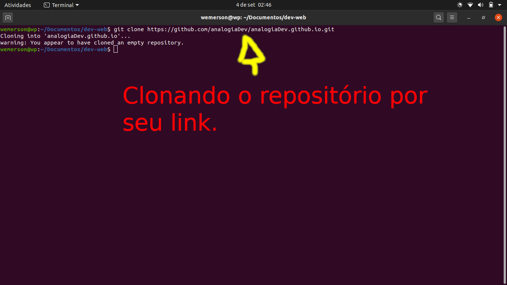

Imagem 3.2 - Clonando o repositório

Após ter clonado, é possível vizualizar o repositório do projeto acessando a pasta que você escolheu ou apenas utilizando o comando `dir` no windows (Imagem 3.3.1) e `ls` no linux (Imagem 3.3.2). 


Imagem 3.3.1 - Vizualizando o repositório via terminal no windows

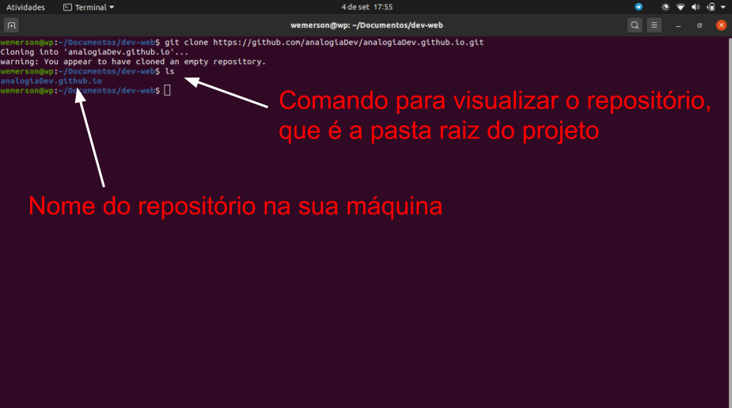

Imagem 3.3.2 - Vizualizando o repositório via terminal no linux

Agora que sabemos o nome do repositório na sua máquina, vamos acessá-lo pelo terminal com o comando `cd nome-do-repositório` (Imagem 3.4), onde `nome-do-repositório`deve ser substituído por o nome do repositório que encontramos no passo anterior, como mostra a Imagem 3.3.1 ou 3.3.2, dependendo do seu sistema operacional.

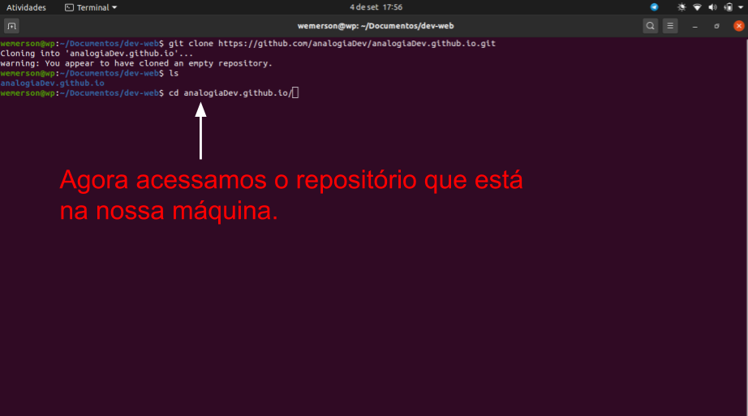

Imagem 3.4 - Entrando no repositório via terminal

Por fim, vamos abrir o repositório no Visual Studio Code (VsCode) que é um editor de código-fonte desenvolvido pela Microsoft para Windows, Linux e macOS. Caso não tenha ele no seu computador, acesse [vscode.com](https://code.visualstudio.com/Download) para baixá-lo e instalá-lo. Após isso, digite no terminal `code .` para abrir o repositório no VsCode (Imagem 3.5).


Imagem 3.5 - Abrindo o repositório no VsCode

Então será aberto uma aba como da Imagem 3.6, onde mostra o vscode com nosso repositório aberto nele.

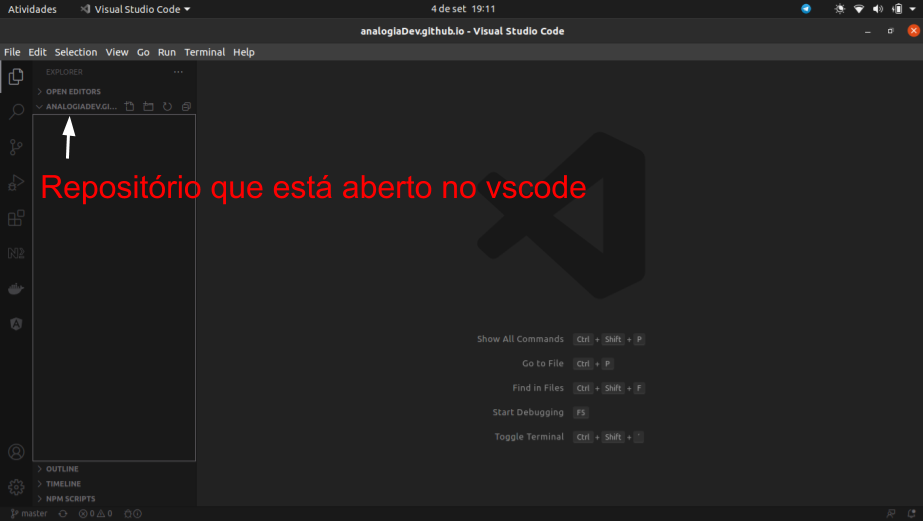

Imagem 3.6 - Vizualizando o repositório aberto no VsCode

Agora vamos criar o arquivo base para nosso site. Clique como o botão direito **no repositório**, então selecione **new file** (Imagem 3.7), então informe o nome do arquivo, que obrigatóriamente para este exemplo, deve-se chama **index.html** como na Imagem 3.8.

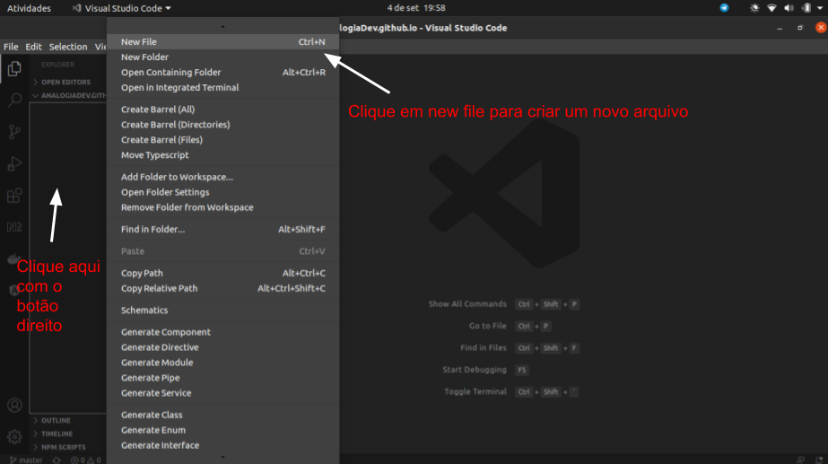

Imagem 3.7 - Clicando em criar um new file (novo arquivo)

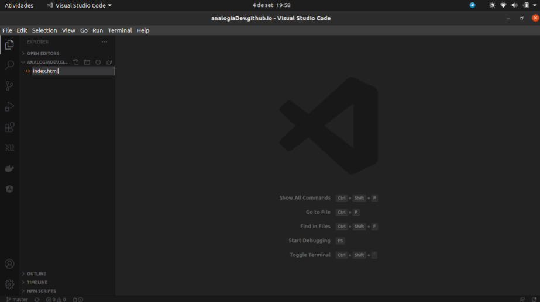

Imagem 3.8 - Nomeando o arquivo

Então clique no arquivo **index.js**, copie e cole o seguinte código de exemplo, modificando `Seu nome` com seu nome:

```
<!DOCTYPE html>
<html lang="en">
<head>
    <meta charset="UTF-8">
    <meta name="viewport" content="width=device-width, initial-scale=1.0">
    <title>Seu nome</title>
</head>
<body>
    <h1>Seja bem vindo!</h1>
    <h3>Seu nome</h3>
</body>
</html>
```

O arquivo deve ficar como o da Imagem 3.9, onde temos a estrutura básica para nosso site, deixando claro que este código é apenas um exemplo e o mesmo pode ser alterado como queira. **Não se esqueça de salvar o arquivo precionando `Control + s`**.

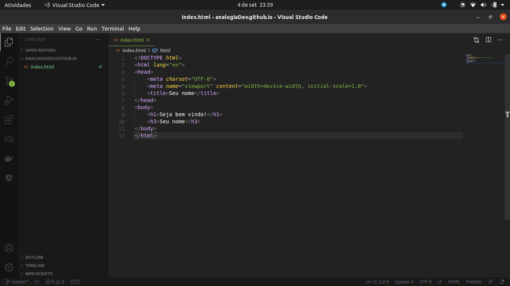

Imagem 3.9 - Estrutura básica do site

As alterações feitas até o momento são locais, então será preciso enviar as alterações para o GitHub, o que será feito no passo 4.

## 4 - Publicando seu site pessoal no Github Pages

Para que seja possível enviar as alterações feitas para o Github, precisamos commitar as alterações, que é o ato de gerar uma nova "versão" do nosso código e enviar está "nova versão" para alguma plataforma de gerenciamento de código, no caso o Github. Então para que seja possível commitar e mandar para nosso repositório. Abra o terminal clicando em **Terminal** depois **new terminal (novo terminal)** como na Imagem 4.1.

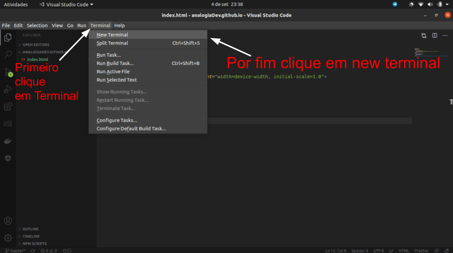

Imagem 4.1 - Abrindo um terminal no VsCode

Note que na parte inferior da sua tela foi aberto um terminal. Agora de fato vamos commitar nossa aplicação. Digite `git add .` para que seja adicionado todos os arquivos ao git. Depois digite `git commit -m "Commit inicial"`. Por fim digite `git push`, e agora mandamos nossas alterações locais para seu repositório no github. Note que **todos** os comandos são descritos na Imagem 4.2.

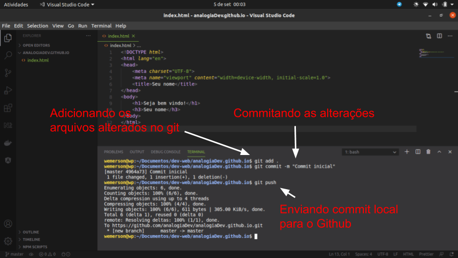

Imagem 4.2 - Comandos git

Então vá no repositório no Github, acesse  **Settings (configurações)** do repositório (Imagem 4.3) 


Imagem 4.3 - Clicando em configurações

Role até a sessão Github pages, onde irá conter o link para seu site, então basta clicar no mesmo e será redirecionado para o seu site (Imagem 4.4).

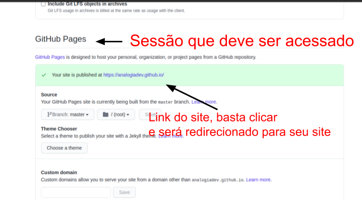

Imagem 4.4 - Clicando no link do site

Após ser redirecionado para o seu site, note que irá aparecer exatamente o que colocamos no arquivo **index.html** (Imagem 4.5). 
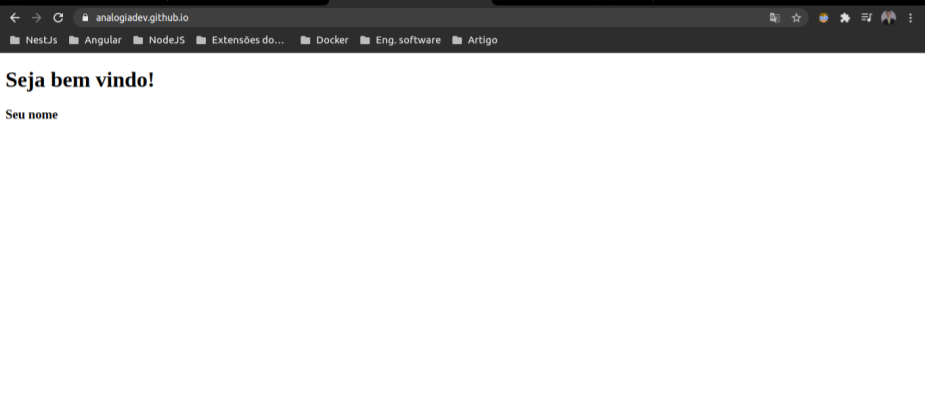

Imagem 4.5 - Vizualizando o site

## 5 - Conclusão

Agora temos um site criado e publicado via Github pages. Modifique o arquivo **index.html** incluindo **css** e/ou **JavaScript** para que a página fique com sua cara. Após modificar o arquivo index.html ou qualquer outro arquivo do seu repositório, lembre-se de mandar o código para seu repositório no github, via os comandos do Git como na Imagem 4.2, e a cada novo commit enviado para o Github, o seu site será atualizado automaticamente.